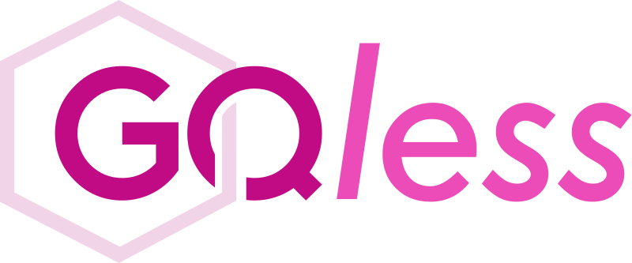

  

<h2 align="center">
  a GraphQL client built for rapid iteration.
  
  
  
</h2>

---

Head over to [gqless.com](https://gqless.com), to explore features and documentation.

---

## Get involved

Documentation, bug reports, pull requests, and all other contributions are welcome! See [`CONTRIBUTING.md`](CONTRIBUTING.md).

## [Sponsors](https://opencollective.com/gqless/contribute)

Docs powered by [Vercel](https://vercel.com/?utm_source=gqless&utm_campaign=oss)
